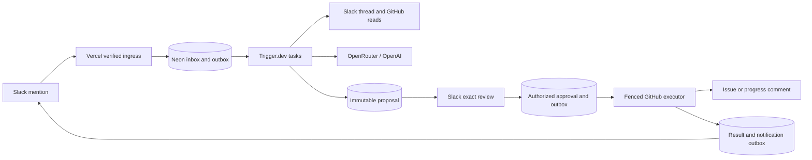

# Signal architecture

Authority: [north star](../north_star.md), [product](PRODUCT.md), and [contracts](CONTRACTS.md). This is the implementation design, not evidence of deployed infrastructure.

## Runtime and ownership

One Next.js App Router repository runs Node.js 24/TypeScript with npm. Vercel hosts signed Slack ingress and the optional inspector; Trigger.dev deploys background tasks from that same repository. Neon PostgreSQL through Drizzle holds application truth. OpenRouter is the sole inference adapter, initially routing `openai/gpt-5.6-luna`. No second workflow engine or inference gateway exists.

Routes verify identity, validate input and commit bounded transactions. Domain services own tenant rules, state transitions and canonicalization. Provider adapters own API formats, timeouts and sanitized error classification. Tasks orchestrate those services; they do not bypass them. The model can propose facts and text but receives neither a mutation tool nor an approval capability.

## From mention to draft

Accept only verified `app_mention` deliveries from the configured workspace and allowed non-shared channels. Persist a minimal event envelope and analysis job/outbox in one transaction before acknowledging. Slack event IDs suppress redelivery. Jobs load content server-side using verified tenant configuration; content never appears in Trigger task arguments.

Read root and all replies, with pagination, author IDs, edit timestamps and source permalinks. Require a complete snapshot of at most 50 messages. A missing page, revoked access or overflow prevents an actionable draft. Bound model context independently to 12,000 input tokens; an oversized complete snapshot is rejected instead of silently truncated. Exclude bot-generated messages from analysis and fingerprinting.

Select the destination by explicit validated update reference, existing thread binding, or the channel's issue-creation mapping, in that order. Search only this repository: at most two queries and five combined issue/PR candidates. Similarity does not authorize choosing an issue target. Verify an update target is an open issue, not a PR.

Model output uses strict structured JSON and runtime validation. Validate each evidence ID against the retrieved snapshot, each URL against retrieved records, and each owner against explicit Slack-to-GitHub mappings and repository eligibility. Permit two model requests total, including repair or failures, with a 30-second request timeout and 2,000 output-token ceiling. Invalid or unsupported output yields an explanation, not a fabricated draft. Structured output helps shape validation; it does not establish truth. See [OpenRouter structured outputs](https://openrouter.ai/docs/guides/features/structured-outputs).

## Approval and execution

Persist final text, destination, stable operation marker and hash before presenting Review/Dismiss. The read-only modal shows the complete mutation and uncertainty. Approving submits only a reference to that persisted version. An authorized Slack actor approves it transactionally; the worker rechecks authorization, expiry and target eligibility before dispatch. No model call or content regeneration occurs after approval.

PostgreSQL compare-and-set transitions fence duplicate runs. Use explicit global Trigger idempotency keys for dispatch, while retaining database uniqueness because provider keys expire and failed runs may release them. This follows [Trigger.dev idempotency](https://trigger.dev/docs/idempotency); it is not a promise of exactly-once GitHub effects.

On a definite GitHub success, persist actual response identity and the Slack notification job together. A Slack failure retries notification only. On uncertain mutation completion, preserve the operation and reconcile its marker. Expired leases alone cannot authorize a competing request. [CONTRACTS.md](CONTRACTS.md) specifies terminal-attempt fencing and manual resolution.

## Data and optional surfaces

Logs and traces contain IDs, hashes, durations, counts and small status/error codes only. Disable provider SDK body logging, prompt tracing and automatic request capture; sanitize thrown errors. Persist source snapshots for at most 24 hours and proposal bodies for seven days; expire executable drafts before deletion. Keep content-free operation/deduplication tombstones and result IDs until tenant deletion so cleanup cannot enable replay. Unknown operations retain marker, target, hashes and attempt metadata; body expiry does not permit retry. Application cleanup cannot erase copies already sent to providers; document their configured retention separately.

Auth0 plus CopilotKit may expose tenant-filtered proposal inspection. Exa may receive a separately approved sanitized public query. Neither path grants GitHub authority. Optional integrations fail closed when disabled and must not break core boot. SaaS work follows [SAAS.md](SAAS.md) after the demo gate.
