# Signal: MVP architecture and autonomous implementation plan

## 1. Objective and scope

Build the fastest reliable Slack → GitHub workflow, with foundations that support a later multi-tenant SaaS.

**Confirmed decisions:**

- Deliver the MVP before SaaS onboarding.
- Use Vercel, managed PostgreSQL, and Vercel Workflows.
- Support creating issues and adding approved progress comments to existing issues.
- Use named Slack approvers acting through a GitHub App.
- Use GPT-6 Astra for Codex planning, critical implementation, and review; use GPT-5.6 Luna for bounded supporting tasks.

The MVP supports one configured workspace, allowlisted channels, and explicit channel-to-repository mappings. Its only trigger is an `@Signal` mention.

Calendar, email, Teams, continuous monitoring, billing, and partner integrations remain outside this implementation scope.

**Deliverable status:** architecture and requirements have received two Astra reviews and Luna requirements/consistency reviews. No Markdown files, application code, or cloud resources have been created in Plan Mode. Saving the documentation package below is the first execution task.

## 2. Architecture and contracts

| Component | Decision |
|---|---|
| Application | TypeScript, Next.js App Router, Node.js 24 |
| Hosting | Vercel Functions using the Node.js runtime |
| Durable execution | Vercel Workflows |
| Database | Neon PostgreSQL through Vercel Marketplace; Drizzle ORM |
| Slack interface | Events API, Block Kit cards, review modals |
| GitHub integration | Selected-repository GitHub App |
| Runtime AI | AI SDK with schema-validated output through Vercel AI Gateway |
| Initial runtime model | `openai/gpt-5.6-luna`, independently selected for the bounded extraction task |
| Testing | Vitest, PostgreSQL integration tests, model evaluations, live Slack/GitHub verification |

The runtime model is separate from Codex’s development model allocation. Luna supports structured outputs; its Gateway identifier was verified during planning. Account access must pass the integration smoke test. [OpenAI model documentation](https://developers.openai.com/api/docs/models/gpt-5.6-luna)

```mermaid
flowchart LR
    S[Slack mention] --> I[Verify request]
    I --> D[(PostgreSQL inbox and outbox)]
    D --> W[Durable analysis workflow]
    W --> R[Read Slack and GitHub context]
    R --> A[Structured AI proposal]
    A --> P[(Immutable proposal)]
    P --> H[Slack review and approval]
    H --> E[Deterministic executor]
    E --> G[GitHub issue or comment]
    G --> N[(Result and notification outbox)]
    N --> C[Update Slack card]
```



**Interaction and analysis**

- Read the invoked thread, its participants, channel metadata, configured repository, and relevant issues/PRs.
- Extract decisions, tasks, owners, blockers, and deadlines with source references.
- Bound each analysis to 50 messages, five GitHub candidates, and two model requests. Cap each request at 12,000 input tokens and 2,000 output tokens.
- If the thread cannot be retrieved completely within those bounds, explain the limitation and withhold approval controls.
- If nothing actionable exists, post a short explanation without action buttons.
- Uncertain owners remain unassigned. Ambiguous deadlines retain the original wording and uncertainty.
- Treat Slack and GitHub content as untrusted evidence. Repository selection, credentials, permissions, and available actions come from application configuration.

An ordinary mention proposes issue creation. `@Signal update #713` targets a progress comment in the channel’s configured repository. A thread already linked to an issue defaults to a progress comment. Multiple explicit issue targets require clarification; semantic search results provide supporting context rather than silently choosing a write destination.

**Public endpoints**

- `POST /api/slack/events`: signature verification, URL verification, durable event acceptance.
- `POST /api/slack/interactions`: review, approve, and dismiss actions.
- `GET /api/internal/maintenance`: authenticated recovery and retention processing.
- `GET /healthz`: minimal health response without configuration details.

Slack handlers acknowledge accepted events and interactions within three seconds. Analysis and GitHub execution run asynchronously. [Slack interaction requirements](https://docs.slack.dev/interactivity/handling-user-interaction/)

**Shared records and types**

Define `TenantContext`, `ThreadContext`, `Analysis`, `Proposal`, `Operation`, and `OutboxJob` as shared validated contracts.

- Every tenant-owned record and relationship includes `tenant_id`.
- Derive tenant identity from the verified Slack installation, never a button value.
- Proposals contain source fingerprints, action type, repository/issue IDs, exact payload, version, hash, expiry, and policy version.
- Operations contain the approved proposal reference, approver, stable operation UUID, dispatch state, and external result IDs.
- Use tenant-inclusive uniqueness constraints and foreign keys.
- Persist thread-to-issue links; allow multiple distinct progress comments over time.

The only executable action types are:

```text
CREATE_ISSUE
ADD_PROGRESS_COMMENT
```

**Approval and execution**

- Show a compact card followed by a modal displaying the complete proposed issue or comment, destination, and assignee.
- Approval applies to that exact payload and expires after 30 minutes.
- Recheck the current named-approver policy and target eligibility before execution.
- Unauthorized clicks receive a private rejection. An empty approver list disables actions.
- Payload changes create a new proposal version and require fresh approval.
- The model has no GitHub mutation capability. A deterministic executor performs approved actions.
- Assignment uses explicit Slack-to-GitHub mappings and repository assignability checks. Report the assignee actually returned by GitHub.

**Recovery**

Use operation states:

```text
READY → SENDING → SUCCEEDED | FAILED | UNKNOWN | STALE
```

Persist inbox/outbox changes atomically. Attempt immediate workflow dispatch and recover missed dispatches through scheduled maintenance.

Both issue and comment creation include a stable operation marker. A timeout or crash after dispatch produces `UNKNOWN`; recovery searches the destination for the marker and verifies author, target, and content. Absence alone does not authorize another POST.

Workflow replay and duplicate starts must encounter the existing operation state rather than repeat the mutation. GitHub success is persisted before Slack notification; notification failures retry only the Slack update. Durable workflows require application-level idempotency for external side effects. [Workflow idempotency](https://workflow-sdk.dev/docs/foundations/idempotency)

## 3. Infrastructure and operational defaults

- Use one Vercel project with isolated development, preview, and production configuration. Preview deployments cannot access production Slack/GitHub credentials.
- Co-locate production functions and Neon in US East.
- Plan production deployment on Vercel Pro; Hobby is restricted to personal, non-commercial use. Verify current charges before provisioning. [Vercel plan restrictions](https://vercel.com/docs/plans/hobby)
- Provision Neon through Marketplace and use pooled database connections with certificate verification.
- Store secrets in Vercel environment management. Document database URLs, Slack credentials, GitHub App credentials, maintenance secret, and runtime model configuration.
- Use Gateway’s managed authentication in deployment and documented local development authentication.
- Upgrade the currently installed Vercel CLI before provisioning: `npm i -g vercel@latest`.
- Give the GitHub App Issues write and Pull requests read access only to selected repositories. Code and commit retrieval are excluded from the MVP.
- Keep source text out of logs. Workflow **and step** inputs/outputs contain identifiers and small status values; sensitive processing happens inside steps.
- Retain temporary source snapshots for at most 24 hours and proposal content for seven days. Retain minimal operation and thread-link metadata until tenant deletion.
- Document provider retention separately; application cleanup does not imply deletion from provider logs.
- Record request latency, queue age, model usage, failures, uncertain operations, and notification failures without logging conversation bodies.
- Provide runbooks for credential revocation, stalled work, uncertain writes, retention cleanup, deployment rollback, and database restoration.

The first live integration gate verifies complete Slack thread retrieval using the installed app’s actual token and distribution type. Slack documents different retrieval limits for internal and commercially distributed applications. No silent token-scope expansion or partial-thread fallback is allowed. [Slack thread retrieval](https://docs.slack.dev/reference/methods/conversations.replies/)

## 4. Markdown package and refinement loop

Create these files during execution:

| Planned file | Purpose |
|---|---|
| `/Users/robcr/Projects/signal/README.md` | Project overview, quick start, documentation index |
| `/Users/robcr/Projects/signal/AGENTS.md` | Model allocation, task selection, verification and stopping rules |
| `/Users/robcr/Projects/signal/docs/PRODUCT.md` | Numbered requirements, accepted scope changes, source brief appendix |
| `/Users/robcr/Projects/signal/docs/ARCHITECTURE.md` | Diagrams, decisions, schemas, interfaces, trust boundaries |
| `/Users/robcr/Projects/signal/docs/INFRASTRUCTURE.md` | Provisioning order, environment matrix, permissions, cost controls |
| `/Users/robcr/Projects/signal/docs/superpowers/plans/2026-09-11-signal.md` | Ordered implementation tasks and acceptance gates |
| `/Users/robcr/Projects/signal/docs/VERIFICATION.md` | Test cases, evaluation fixtures, traceability, demo script |
| `/Users/robcr/Projects/signal/docs/OPERATIONS.md` | Recovery, monitoring, retention, rollback and restoration |
| `/Users/robcr/Projects/signal/docs/SAAS.md` | Multi-tenant expansion architecture and release gates |
| `/Users/robcr/Projects/signal/STATUS.md` | Completed work, evidence, blockers, next task, review findings |

Every implementation task specifies dependencies, responsible model, affected files, interfaces, verification commands, and observable completion criteria.

**Documentation refinement loop**

1. Astra drafts architecture, contracts, infrastructure, and implementation tasks.
2. Luna checks requirement coverage, references, terminology, and checklist consistency.
3. Astra resolves findings and walks through normal execution, rejection, failure, replay, and recovery.
4. Repeat only for remaining findings, with a maximum of three passes.

Exit criteria: every MVP requirement maps to a task and verification case; interfaces and state names agree; no blocking architectural decisions remain; external prerequisites are explicit; SaaS work cannot silently enter the MVP.

**Autonomous implementation loop**

Read the current task and its referenced documents → implement → run relevant checks → review → record evidence and the next task → continue.

Astra owns authorization, tenant boundaries, persistence, execution/recovery, infrastructure, and final review. Luna handles bounded documentation maintenance, fixture preparation, and presentation work under defined contracts. Avoid repeated full-history reviews and unrelated refactors. Escalate a task after two unsuccessful repair attempts instead of looping indefinitely.

## 5. Delivery sequence and acceptance gates

1. **Documentation and integration proof:** save and refine the package; verify Slack thread retrieval, GitHub App permissions, database connectivity, durable execution, and runtime model access.
2. **Reliable ingestion:** implement signed requests, tenant resolution, inbox/outbox transactions, deduplication, and recovery dispatch.
3. **Evidence-backed proposals:** implement bounded extraction, GitHub retrieval, uncertainty handling, and Slack review cards/modals.
4. **Approved actions:** implement issue creation, progress comments, identity mapping, immutable approval, reconciliation, and Slack result updates.
5. **MVP verification:** complete automated checks and the live two-minute demo before SaaS expansion.
6. **SaaS expansion:** add Slack/GitHub OAuth installation flows, verified installation linking, encrypted tenant credentials, tenant administration in Slack App Home, installation revocation handling, per-tenant quotas, and database row-level security. Require two-workspace isolation tests before admitting a second customer.

OAuth state must be single-use, expiring, and bound to the installing administrator and tenant. Billing and additional workplace integrations remain deferred.

**Required acceptance cases**

- Both create-issue and progress-comment workflows succeed with real integrations.
- No GitHub write occurs before valid approval.
- Duplicate deliveries, concurrent clicks, and workflow replay produce one operation.
- Lost GitHub responses reconcile without another POST.
- A crash before workflow dispatch is recovered.
- Slack failure after GitHub success causes notification-only recovery.
- Unauthorized, expired, superseded, and cross-tenant requests cannot execute.
- Missing identities, incomplete threads, unavailable providers, malformed model output, and prompt injection fail safely.
- Related links and asserted facts are grounded in retrieved evidence.
- Application logs and workflow traces contain no source text or credentials.
- A 20-case evaluation set passes every authorization/injection case and at least 90% of annotated extraction checks.
- The live demo completes within two minutes under normal, non-rate-limited conditions.

Record actual evidence using `PASS`, `FAIL`, `PARTIAL`, or `NOT RUN`. Infrastructure account identifiers, credentials, installation approvals, and any paid-plan authorization are execution prerequisites; their absence must never be represented as a completed integration.

